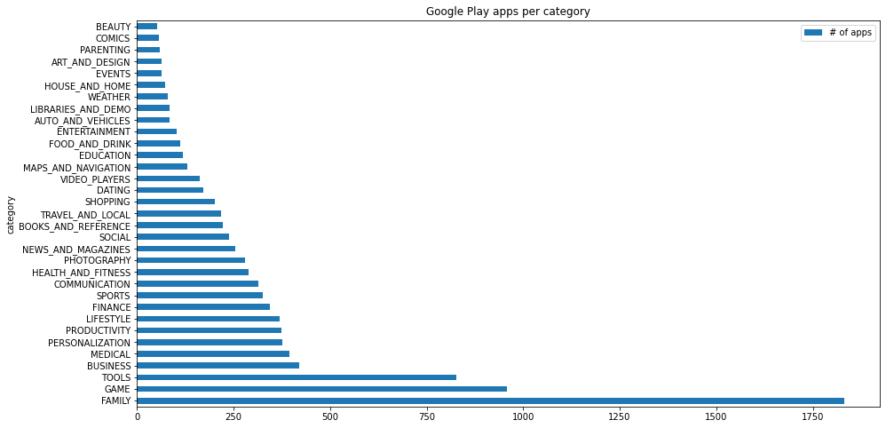
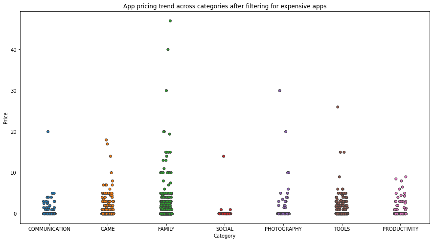

# 1. Project overview & the data

This project will showcase a comprehensive analysis of the Android app market by comparing over 10,000 apps in Google Play across different categories. We'll look for insights in the data to devise strategies to drive growth and retention.

This project is based on an exercise in the "Data Scientist with Python Track" on DataCamp which I am currently undertaking (Jan 2021) with various additions and changes of my own.

The Dataset comprises two files:

1. apps.csv: details of the applications on Google Play. There are 13 features that describe any given app in the dataset.

2. user_reviews.csv: contains 100 reviews for each app, most helpful first. The text in each review has been pre-processed and attributed with three new features: Sentiment (Positive, Negative or Neutral), Sentiment Polarity and Sentiment Subjectivity.

We'll start by importing the apps csv file and running a few preliminary queries to:

- drop duplicates
- check how many unique apps are in the dataset
- print an info summary of the data to check data types, null values, columns etc.
- print a random sample of 5 rows

# 2. Importing the data & initial review


```python
# Read in dataset
import pandas as pd
apps_with_duplicates = pd.DataFrame(pd.read_csv('datasets/apps.csv'))

# Drop duplicates
apps = apps_with_duplicates.drop_duplicates()

# Print the total number of apps
print('Total number of apps in the dataset = ', len(apps.index))

# Print a concise summary of apps dataframe
print(apps.info())

# Have a look at a random sample of n rows
n = 5
apps.sample(n)
```

    Total number of apps in the dataset =  9659
    <class 'pandas.core.frame.DataFrame'>
    Int64Index: 9659 entries, 0 to 9658
    Data columns (total 14 columns):
     #   Column          Non-Null Count  Dtype  
    ---  ------          --------------  -----  
     0   Unnamed: 0      9659 non-null   int64  
     1   App             9659 non-null   object 
     2   Category        9659 non-null   object 
     3   Rating          8196 non-null   float64
     4   Reviews         9659 non-null   int64  
     5   Size            8432 non-null   float64
     6   Installs        9659 non-null   object 
     7   Type            9659 non-null   object 
     8   Price           9659 non-null   object 
     9   Content Rating  9659 non-null   object 
     10  Genres          9659 non-null   object 
     11  Last Updated    9659 non-null   object 
     12  Current Ver     9651 non-null   object 
     13  Android Ver     9657 non-null   object 
    dtypes: float64(2), int64(2), object(10)
    memory usage: 1.1+ MB
    None


<div>
<style scoped>
    .dataframe tbody tr th:only-of-type {
        vertical-align: middle;
    }

    .dataframe tbody tr th {
        vertical-align: top;
    }

    .dataframe thead th {
        text-align: right;
    }
</style>
<table border="1" class="dataframe">
  <thead>
    <tr style="text-align: right;">
      <th></th>
      <th>Unnamed: 0</th>
      <th>App</th>
      <th>Category</th>
      <th>Rating</th>
      <th>Reviews</th>
      <th>Size</th>
      <th>Installs</th>
      <th>Type</th>
      <th>Price</th>
      <th>Content Rating</th>
      <th>Genres</th>
      <th>Last Updated</th>
      <th>Current Ver</th>
      <th>Android Ver</th>
    </tr>
  </thead>
  <tbody>
    <tr>
      <th>3755</th>
      <td>4671</td>
      <td>V LIVE - Star Live App</td>
      <td>FAMILY</td>
      <td>4.4</td>
      <td>397147</td>
      <td>NaN</td>
      <td>10,000,000+</td>
      <td>Free</td>
      <td>0</td>
      <td>Teen</td>
      <td>Entertainment</td>
      <td>August 2, 2018</td>
      <td>Varies with device</td>
      <td>Varies with device</td>
    </tr>
    <tr>
      <th>6046</th>
      <td>7089</td>
      <td>CA UIM Mobile</td>
      <td>BUSINESS</td>
      <td>3.2</td>
      <td>54</td>
      <td>7.7</td>
      <td>1,000+</td>
      <td>Free</td>
      <td>0</td>
      <td>Everyone</td>
      <td>Business</td>
      <td>February 29, 2016</td>
      <td>8.4.1</td>
      <td>4.0 and up</td>
    </tr>
    <tr>
      <th>7616</th>
      <td>8726</td>
      <td>DRAGON QUEST VI</td>
      <td>FAMILY</td>
      <td>4.4</td>
      <td>3358</td>
      <td>17.0</td>
      <td>100,000+</td>
      <td>Paid</td>
      <td>$14.99</td>
      <td>Everyone</td>
      <td>Role Playing</td>
      <td>August 1, 2018</td>
      <td>1.0.4</td>
      <td>2.3 and up</td>
    </tr>
    <tr>
      <th>4018</th>
      <td>4961</td>
      <td>Ad Blocker Turbo - Adblocker Browser</td>
      <td>COMMUNICATION</td>
      <td>3.9</td>
      <td>107</td>
      <td>44.0</td>
      <td>10,000+</td>
      <td>Free</td>
      <td>0</td>
      <td>Everyone</td>
      <td>Communication</td>
      <td>January 29, 2018</td>
      <td>1.0.5</td>
      <td>4.1 and up</td>
    </tr>
    <tr>
      <th>8447</th>
      <td>9578</td>
      <td>EM Launcher for EMUI</td>
      <td>PERSONALIZATION</td>
      <td>4.1</td>
      <td>3175</td>
      <td>2.3</td>
      <td>500,000+</td>
      <td>Free</td>
      <td>0</td>
      <td>Everyone</td>
      <td>Personalization</td>
      <td>April 6, 2018</td>
      <td>1.0.6</td>
      <td>4.1 and up</td>
    </tr>
  </tbody>
</table>
</div>


# 2. Data cleaning

The features/columns that we will focus on are Category, Rating, Installs, Size, and Price. 

The info() function (from the previous task) told us that the Installs and Price columns are of type 'object' and not int64 or float64 as we would expect. This is because the column contains some characters more than just digits. Ideally, we would want these columns to be numeric so we can perform calculations on them for further analysis.

Let's move on to data cleaning, which would involve:

1. removing special characters (, $ +) in the Installs and Price columns as those make their conversion to a numerical data type difficult.
2. converting those columns to numeric data type.


```python
# List of characters to remove
chars_to_remove = ['+', ',', '$']
# List of column names to clean
cols_to_clean = ['Installs', 'Price']

# Loop for each column
for col in cols_to_clean:
    for char in chars_to_remove:
        apps[col] = apps[col].astype(str).str.replace(char, "")
    # Convert col to numeric
    apps[col] = pd.to_numeric(apps[col]) 
```


```python
#check type has been changed
apps.info()
```

    <class 'pandas.core.frame.DataFrame'>
    Int64Index: 9659 entries, 0 to 9658
    Data columns (total 14 columns):
     #   Column          Non-Null Count  Dtype  
    ---  ------          --------------  -----  
     0   Unnamed: 0      9659 non-null   int64  
     1   App             9659 non-null   object 
     2   Category        9659 non-null   object 
     3   Rating          8196 non-null   float64
     4   Reviews         9659 non-null   int64  
     5   Size            8432 non-null   float64
     6   Installs        9659 non-null   int64  
     7   Type            9659 non-null   object 
     8   Price           9659 non-null   float64
     9   Content Rating  9659 non-null   object 
     10  Genres          9659 non-null   object 
     11  Last Updated    9659 non-null   object 
     12  Current Ver     9651 non-null   object 
     13  Android Ver     9657 non-null   object 
    dtypes: float64(3), int64(3), object(8)
    memory usage: 1.1+ MB


```python
#check characters have been removed
apps.Installs.head(5)
```


    0       10000
    1      500000
    2     5000000
    3    50000000
    4      100000
    Name: Installs, dtype: int64


```python
apps.Price.head(5)
```


    0    0.0
    1    0.0
    2    0.0
    3    0.0
    4    0.0
    Name: Price, dtype: float64


# 3. Exploring the data

## App categories

We'll start exploring our dataset by looking at the app categories. It would be interesting to explore the following questions:

- How many app categories are there on Google Play?
- Which category has the highest share of (active) apps in the Google Play market?
- Is any specific category dominating the Google Play market (i.e. which category has the highest number of installs)?
- Which categories have the fewest number of apps?

We will see that:

- there are 33 unique app categories present in our dataset. 
- Family and Game apps have the highest market prevalence (with almost 19% and 10% of the market respectively). Tools, Business and Medical apps are also at the top.
- The categories with the least number of apps on Google Play are Beauty, Comics and Parenting (with around 6%of the mearket each).

Let's explore!


```python
# Print the total number of unique categories
num_categories = len(apps['Category'].unique())
print('Number of categories = ', num_categories)

# Count the number of apps in each 'Category' and sort them in descending order
num_apps_in_category = apps['Category'].value_counts().sort_values(ascending = False)
print(num_apps_in_category)
```

    Number of categories =  33
    FAMILY                 1832
    GAME                    959
    TOOLS                   827
    BUSINESS                420
    MEDICAL                 395
    PERSONALIZATION         376
    PRODUCTIVITY            374
    LIFESTYLE               369
    FINANCE                 345
    SPORTS                  325
    COMMUNICATION           315
    HEALTH_AND_FITNESS      288
    PHOTOGRAPHY             281
    NEWS_AND_MAGAZINES      254
    SOCIAL                  239
    BOOKS_AND_REFERENCE     222
    TRAVEL_AND_LOCAL        219
    SHOPPING                202
    DATING                  171
    VIDEO_PLAYERS           163
    MAPS_AND_NAVIGATION     131
    EDUCATION               119
    FOOD_AND_DRINK          112
    ENTERTAINMENT           102
    AUTO_AND_VEHICLES        85
    LIBRARIES_AND_DEMO       84
    WEATHER                  79
    HOUSE_AND_HOME           74
    EVENTS                   64
    ART_AND_DESIGN           64
    PARENTING                60
    COMICS                   56
    BEAUTY                   53
    Name: Category, dtype: int64


```python
#convert series into dataframe
num_apps_in_category = num_apps_in_category.to_frame().reset_index()
```


```python
#validate conversion to DF worked 
num_apps_in_category.info()
```

    <class 'pandas.core.frame.DataFrame'>
    RangeIndex: 33 entries, 0 to 32
    Data columns (total 2 columns):
     #   Column    Non-Null Count  Dtype 
    ---  ------    --------------  ----- 
     0   index     33 non-null     object
     1   Category  33 non-null     int64 
    dtypes: int64(1), object(1)
    memory usage: 656.0+ bytes


```python
#check the index column
num_apps_in_category.index
```


    RangeIndex(start=0, stop=33, step=1)


```python
#rename dataframe cols
num_apps_in_category.columns = ['category', '# of apps', '% of market']
```


```python
# Visualise the number of apps by category

num_apps_in_category.plot.barh(x='category', y='# of apps', figsize=(15,8), title='Google Play apps per category')
```


    <matplotlib.axes._subplots.AxesSubplot at 0x11bb3d790>





```python
#calculate percetange of overall app market per category
num_apps_in_category['% of market'] = 100 * num_apps_in_category['# of apps'] / num_apps_in_category['# of apps'].sum()
```


```python
#view result
num_apps_in_category
```


<div>
<style scoped>
    .dataframe tbody tr th:only-of-type {
        vertical-align: middle;
    }

    .dataframe tbody tr th {
        vertical-align: top;
    }

    .dataframe thead th {
        text-align: right;
    }
</style>
<table border="1" class="dataframe">
  <thead>
    <tr style="text-align: right;">
      <th></th>
      <th>category</th>
      <th># of apps</th>
      <th>% of market</th>
    </tr>
  </thead>
  <tbody>
    <tr>
      <th>0</th>
      <td>FAMILY</td>
      <td>1832</td>
      <td>18.966767</td>
    </tr>
    <tr>
      <th>1</th>
      <td>GAME</td>
      <td>959</td>
      <td>9.928564</td>
    </tr>
    <tr>
      <th>2</th>
      <td>TOOLS</td>
      <td>827</td>
      <td>8.561963</td>
    </tr>
    <tr>
      <th>3</th>
      <td>BUSINESS</td>
      <td>420</td>
      <td>4.348276</td>
    </tr>
    <tr>
      <th>4</th>
      <td>MEDICAL</td>
      <td>395</td>
      <td>4.089450</td>
    </tr>
    <tr>
      <th>5</th>
      <td>PERSONALIZATION</td>
      <td>376</td>
      <td>3.892743</td>
    </tr>
    <tr>
      <th>6</th>
      <td>PRODUCTIVITY</td>
      <td>374</td>
      <td>3.872036</td>
    </tr>
    <tr>
      <th>7</th>
      <td>LIFESTYLE</td>
      <td>369</td>
      <td>3.820271</td>
    </tr>
    <tr>
      <th>8</th>
      <td>FINANCE</td>
      <td>345</td>
      <td>3.571798</td>
    </tr>
    <tr>
      <th>9</th>
      <td>SPORTS</td>
      <td>325</td>
      <td>3.364738</td>
    </tr>
    <tr>
      <th>10</th>
      <td>COMMUNICATION</td>
      <td>315</td>
      <td>3.261207</td>
    </tr>
    <tr>
      <th>11</th>
      <td>HEALTH_AND_FITNESS</td>
      <td>288</td>
      <td>2.981675</td>
    </tr>
    <tr>
      <th>12</th>
      <td>PHOTOGRAPHY</td>
      <td>281</td>
      <td>2.909204</td>
    </tr>
    <tr>
      <th>13</th>
      <td>NEWS_AND_MAGAZINES</td>
      <td>254</td>
      <td>2.629672</td>
    </tr>
    <tr>
      <th>14</th>
      <td>SOCIAL</td>
      <td>239</td>
      <td>2.474376</td>
    </tr>
    <tr>
      <th>15</th>
      <td>BOOKS_AND_REFERENCE</td>
      <td>222</td>
      <td>2.298375</td>
    </tr>
    <tr>
      <th>16</th>
      <td>TRAVEL_AND_LOCAL</td>
      <td>219</td>
      <td>2.267315</td>
    </tr>
    <tr>
      <th>17</th>
      <td>SHOPPING</td>
      <td>202</td>
      <td>2.091314</td>
    </tr>
    <tr>
      <th>18</th>
      <td>DATING</td>
      <td>171</td>
      <td>1.770370</td>
    </tr>
    <tr>
      <th>19</th>
      <td>VIDEO_PLAYERS</td>
      <td>163</td>
      <td>1.687545</td>
    </tr>
    <tr>
      <th>20</th>
      <td>MAPS_AND_NAVIGATION</td>
      <td>131</td>
      <td>1.356248</td>
    </tr>
    <tr>
      <th>21</th>
      <td>EDUCATION</td>
      <td>119</td>
      <td>1.232012</td>
    </tr>
    <tr>
      <th>22</th>
      <td>FOOD_AND_DRINK</td>
      <td>112</td>
      <td>1.159540</td>
    </tr>
    <tr>
      <th>23</th>
      <td>ENTERTAINMENT</td>
      <td>102</td>
      <td>1.056010</td>
    </tr>
    <tr>
      <th>24</th>
      <td>AUTO_AND_VEHICLES</td>
      <td>85</td>
      <td>0.880008</td>
    </tr>
    <tr>
      <th>25</th>
      <td>LIBRARIES_AND_DEMO</td>
      <td>84</td>
      <td>0.869655</td>
    </tr>
    <tr>
      <th>26</th>
      <td>WEATHER</td>
      <td>79</td>
      <td>0.817890</td>
    </tr>
    <tr>
      <th>27</th>
      <td>HOUSE_AND_HOME</td>
      <td>74</td>
      <td>0.766125</td>
    </tr>
    <tr>
      <th>28</th>
      <td>EVENTS</td>
      <td>64</td>
      <td>0.662594</td>
    </tr>
    <tr>
      <th>29</th>
      <td>ART_AND_DESIGN</td>
      <td>64</td>
      <td>0.662594</td>
    </tr>
    <tr>
      <th>30</th>
      <td>PARENTING</td>
      <td>60</td>
      <td>0.621182</td>
    </tr>
    <tr>
      <th>31</th>
      <td>COMICS</td>
      <td>56</td>
      <td>0.579770</td>
    </tr>
    <tr>
      <th>32</th>
      <td>BEAUTY</td>
      <td>53</td>
      <td>0.548711</td>
    </tr>
  </tbody>
</table>
</div>


```python
#reset category col as index
num_apps_in_category.set_index(['category'], inplace=True)
```


```python
#plot categories by % of total apps on Google Play
num_apps_in_category.plot.pie(y='% of market',figsize=(20,10), legend=None)
```


    <matplotlib.axes._subplots.AxesSubplot at 0x1227d1e80>


Now that we know which categories offer the most and least apps we can also check which category is dominating the market, based on the total number of installs of apps within a category (as opposed to the number of apps available within a category). It would be interesting to see if this analysis brings up the same categories as above.


```python
downloads_per_cat = apps.groupby(['Category'])['Installs'].sum().sort_values(ascending=False)
```


```python
print(downloads_per_cat)
```

    Category
    GAME                   13878924415
    COMMUNICATION          11038276251
    TOOLS                   8001771915
    PRODUCTIVITY            5793091369
    SOCIAL                  5487867902
    PHOTOGRAPHY             4649147655
    FAMILY                  4427941505
    VIDEO_PLAYERS           3926902720
    TRAVEL_AND_LOCAL        2894887146
    NEWS_AND_MAGAZINES      2369217760
    ENTERTAINMENT           2113660000
    BOOKS_AND_REFERENCE     1665969576
    PERSONALIZATION         1532494782
    SHOPPING                1400348785
    HEALTH_AND_FITNESS      1144022512
    SPORTS                  1096474498
    BUSINESS                 697164865
    LIFESTYLE                503823539
    MAPS_AND_NAVIGATION      503281890
    FINANCE                  455348734
    WEATHER                  361100520
    EDUCATION                352952000
    FOOD_AND_DRINK           211798751
    DATING                   140926107
    ART_AND_DESIGN           114338100
    HOUSE_AND_HOME            97212461
    AUTO_AND_VEHICLES         53130211
    LIBRARIES_AND_DEMO        52995910
    COMICS                    44981150
    MEDICAL                   38193177
    PARENTING                 31521110
    BEAUTY                    27197050
    EVENTS                    15973161
    Name: Installs, dtype: int64


INSIGHTS

- Interestingly, when it comes to the number of downloads, the Games category is the one with the highest number (over 14bn downloads), followed by Communication (with over 11bn downloads), Tools and Productivity (with 8bn and 5.7bn downloads respectively). 

- By running a similar calculation as above, we can see the market share of these categories - it appears that Game captures almost 19% of the total installs on Google Play while Communication apps account for almost 15% of the total installs on the platform.

- Surprisingly, fitness/health apps only amount to 1.5% of the installs and dating apps only around 1.8%.


```python
#convert series to DF
downloads_per_cat = downloads_per_cat.to_frame()

```


```python
downloads_per_cat
```


<div>
<style scoped>
    .dataframe tbody tr th:only-of-type {
        vertical-align: middle;
    }

    .dataframe tbody tr th {
        vertical-align: top;
    }

    .dataframe thead th {
        text-align: right;
    }
</style>
<table border="1" class="dataframe">
  <thead>
    <tr style="text-align: right;">
      <th></th>
      <th>Installs</th>
    </tr>
    <tr>
      <th>Category</th>
      <th></th>
    </tr>
  </thead>
  <tbody>
    <tr>
      <th>GAME</th>
      <td>13878924415</td>
    </tr>
    <tr>
      <th>COMMUNICATION</th>
      <td>11038276251</td>
    </tr>
    <tr>
      <th>TOOLS</th>
      <td>8001771915</td>
    </tr>
    <tr>
      <th>PRODUCTIVITY</th>
      <td>5793091369</td>
    </tr>
    <tr>
      <th>SOCIAL</th>
      <td>5487867902</td>
    </tr>
    <tr>
      <th>PHOTOGRAPHY</th>
      <td>4649147655</td>
    </tr>
    <tr>
      <th>FAMILY</th>
      <td>4427941505</td>
    </tr>
    <tr>
      <th>VIDEO_PLAYERS</th>
      <td>3926902720</td>
    </tr>
    <tr>
      <th>TRAVEL_AND_LOCAL</th>
      <td>2894887146</td>
    </tr>
    <tr>
      <th>NEWS_AND_MAGAZINES</th>
      <td>2369217760</td>
    </tr>
    <tr>
      <th>ENTERTAINMENT</th>
      <td>2113660000</td>
    </tr>
    <tr>
      <th>BOOKS_AND_REFERENCE</th>
      <td>1665969576</td>
    </tr>
    <tr>
      <th>PERSONALIZATION</th>
      <td>1532494782</td>
    </tr>
    <tr>
      <th>SHOPPING</th>
      <td>1400348785</td>
    </tr>
    <tr>
      <th>HEALTH_AND_FITNESS</th>
      <td>1144022512</td>
    </tr>
    <tr>
      <th>SPORTS</th>
      <td>1096474498</td>
    </tr>
    <tr>
      <th>BUSINESS</th>
      <td>697164865</td>
    </tr>
    <tr>
      <th>LIFESTYLE</th>
      <td>503823539</td>
    </tr>
    <tr>
      <th>MAPS_AND_NAVIGATION</th>
      <td>503281890</td>
    </tr>
    <tr>
      <th>FINANCE</th>
      <td>455348734</td>
    </tr>
    <tr>
      <th>WEATHER</th>
      <td>361100520</td>
    </tr>
    <tr>
      <th>EDUCATION</th>
      <td>352952000</td>
    </tr>
    <tr>
      <th>FOOD_AND_DRINK</th>
      <td>211798751</td>
    </tr>
    <tr>
      <th>DATING</th>
      <td>140926107</td>
    </tr>
    <tr>
      <th>ART_AND_DESIGN</th>
      <td>114338100</td>
    </tr>
    <tr>
      <th>HOUSE_AND_HOME</th>
      <td>97212461</td>
    </tr>
    <tr>
      <th>AUTO_AND_VEHICLES</th>
      <td>53130211</td>
    </tr>
    <tr>
      <th>LIBRARIES_AND_DEMO</th>
      <td>52995910</td>
    </tr>
    <tr>
      <th>COMICS</th>
      <td>44981150</td>
    </tr>
    <tr>
      <th>MEDICAL</th>
      <td>38193177</td>
    </tr>
    <tr>
      <th>PARENTING</th>
      <td>31521110</td>
    </tr>
    <tr>
      <th>BEAUTY</th>
      <td>27197050</td>
    </tr>
    <tr>
      <th>EVENTS</th>
      <td>15973161</td>
    </tr>
  </tbody>
</table>
</div>


```python
#calculate % of installs out of total and place in new col
downloads_per_cat['% of total installs'] = 100 * downloads_per_cat['Installs'] / downloads_per_cat['Installs'].sum()
downloads_per_cat
```


<div>
<style scoped>
    .dataframe tbody tr th:only-of-type {
        vertical-align: middle;
    }

    .dataframe tbody tr th {
        vertical-align: top;
    }

    .dataframe thead th {
        text-align: right;
    }
</style>
<table border="1" class="dataframe">
  <thead>
    <tr style="text-align: right;">
      <th></th>
      <th>Installs</th>
      <th>% of total installs</th>
    </tr>
    <tr>
      <th>Category</th>
      <th></th>
      <th></th>
    </tr>
  </thead>
  <tbody>
    <tr>
      <th>GAME</th>
      <td>13878924415</td>
      <td>18.474949</td>
    </tr>
    <tr>
      <th>COMMUNICATION</th>
      <td>11038276251</td>
      <td>14.693616</td>
    </tr>
    <tr>
      <th>TOOLS</th>
      <td>8001771915</td>
      <td>10.651570</td>
    </tr>
    <tr>
      <th>PRODUCTIVITY</th>
      <td>5793091369</td>
      <td>7.711481</td>
    </tr>
    <tr>
      <th>SOCIAL</th>
      <td>5487867902</td>
      <td>7.305183</td>
    </tr>
    <tr>
      <th>PHOTOGRAPHY</th>
      <td>4649147655</td>
      <td>6.188719</td>
    </tr>
    <tr>
      <th>FAMILY</th>
      <td>4427941505</td>
      <td>5.894260</td>
    </tr>
    <tr>
      <th>VIDEO_PLAYERS</th>
      <td>3926902720</td>
      <td>5.227302</td>
    </tr>
    <tr>
      <th>TRAVEL_AND_LOCAL</th>
      <td>2894887146</td>
      <td>3.853533</td>
    </tr>
    <tr>
      <th>NEWS_AND_MAGAZINES</th>
      <td>2369217760</td>
      <td>3.153787</td>
    </tr>
    <tr>
      <th>ENTERTAINMENT</th>
      <td>2113660000</td>
      <td>2.813601</td>
    </tr>
    <tr>
      <th>BOOKS_AND_REFERENCE</th>
      <td>1665969576</td>
      <td>2.217658</td>
    </tr>
    <tr>
      <th>PERSONALIZATION</th>
      <td>1532494782</td>
      <td>2.039983</td>
    </tr>
    <tr>
      <th>SHOPPING</th>
      <td>1400348785</td>
      <td>1.864076</td>
    </tr>
    <tr>
      <th>HEALTH_AND_FITNESS</th>
      <td>1144022512</td>
      <td>1.522867</td>
    </tr>
    <tr>
      <th>SPORTS</th>
      <td>1096474498</td>
      <td>1.459574</td>
    </tr>
    <tr>
      <th>BUSINESS</th>
      <td>697164865</td>
      <td>0.928032</td>
    </tr>
    <tr>
      <th>LIFESTYLE</th>
      <td>503823539</td>
      <td>0.670665</td>
    </tr>
    <tr>
      <th>MAPS_AND_NAVIGATION</th>
      <td>503281890</td>
      <td>0.669944</td>
    </tr>
    <tr>
      <th>FINANCE</th>
      <td>455348734</td>
      <td>0.606138</td>
    </tr>
    <tr>
      <th>WEATHER</th>
      <td>361100520</td>
      <td>0.480679</td>
    </tr>
    <tr>
      <th>EDUCATION</th>
      <td>352952000</td>
      <td>0.469833</td>
    </tr>
    <tr>
      <th>FOOD_AND_DRINK</th>
      <td>211798751</td>
      <td>0.281936</td>
    </tr>
    <tr>
      <th>DATING</th>
      <td>140926107</td>
      <td>0.187594</td>
    </tr>
    <tr>
      <th>ART_AND_DESIGN</th>
      <td>114338100</td>
      <td>0.152201</td>
    </tr>
    <tr>
      <th>HOUSE_AND_HOME</th>
      <td>97212461</td>
      <td>0.129404</td>
    </tr>
    <tr>
      <th>AUTO_AND_VEHICLES</th>
      <td>53130211</td>
      <td>0.070724</td>
    </tr>
    <tr>
      <th>LIBRARIES_AND_DEMO</th>
      <td>52995910</td>
      <td>0.070546</td>
    </tr>
    <tr>
      <th>COMICS</th>
      <td>44981150</td>
      <td>0.059877</td>
    </tr>
    <tr>
      <th>MEDICAL</th>
      <td>38193177</td>
      <td>0.050841</td>
    </tr>
    <tr>
      <th>PARENTING</th>
      <td>31521110</td>
      <td>0.041959</td>
    </tr>
    <tr>
      <th>BEAUTY</th>
      <td>27197050</td>
      <td>0.036203</td>
    </tr>
    <tr>
      <th>EVENTS</th>
      <td>15973161</td>
      <td>0.021263</td>
    </tr>
  </tbody>
</table>
</div>


```python
#reset index for the DF
downloads_per_cat.reset_index(inplace=True)
```


```python
#plot the % of total installs per category
downloads_per_cat.plot.bar(x='Category', y='% of total installs', figsize=(15,8), title='Google Play app installs per category (% of total)', color='g')
```


    <matplotlib.axes._subplots.AxesSubplot at 0x1233b3af0>


## App ratings

Now that we've explored and analysed the app categories, we can turn to the app ratings. App ratings are an important KPI as they impact discoverability, conversion and the brand's overall image. Questions to look at would be:

- what is the average app rating on Google Play?
- what is the ratings distribution (i.e. where do most apps rank? where do the minority of apps rank)?
- are the majority of apps highly rated?


```python
# Average rating of apps
avg_app_rating = apps['Rating'].mean()
print('Average app rating = ', avg_app_rating)
```

    Average app rating =  4.173243045387998


Looks like the average app rating on Google Play is 4.1. Let's run a few more statistical calculations on Rating to see the highest, lowest and median ratings across all apps.

Pandas' describe function is really helpful as it provides summary descriptive statistics that tell us the central tendency, dispersion and shape of a dataset or column distribution.


```python
#get summary statistics for the Rating col
apps['Rating'].describe()
```


    count    8196.000000
    mean        4.173243
    std         0.536625
    min         1.000000
    25%         4.000000
    50%         4.300000
    75%         4.500000
    max         5.000000
    Name: Rating, dtype: float64


INSIGHTS

- Google Play has 8,196 app ratings.
- The average app rating is 4.1.
- The lowest rating is 1 and the highest rating is 5.
- The median (50th percentile) is 4.3.

Now, let's visualise the ratings distribution using a histogram.


```python
#plot a histogram of the Rating col
apps['Rating'].plot.hist(figsize=(15,8), title='Google Play app ratings distribution', color='m')
```


    <matplotlib.axes._subplots.AxesSubplot at 0x12363cf70>


INSIGHTS

As we can see in the above histogram, the ratings distribution is skewed to the right, which tells us that most apps on Google Play are highly rated and the minority of apps have low ratings. We can also see that a rating between 4.3-4.6 is the most frequent.

## App size & price vs rating

Let's now examine app size and price. 

Size is relevant to an app's success, an app that is too large may be difficult and/or expensive for users to download. Lengthy download times could turn users off before they even experience your app. Additionally, users devices have a finite amount of space. 

Pricing is also important to consider, as some users expect mobile apps to be free or rather inexpensive and so pricing can impact adoption rates and user numbers. 

A few interesting questions we could explore here are:

- Does the size of an app affect its rating?
- Do users prefer light-weighted apps?
- Does the price of an app affect its rating?
- Do users prefer free apps over paid apps?

As you'll see below, the majority of top rated apps (with a rating over 4) range from 2 MB to 20 MB. 

We also find that the vast majority of top rated apps are either free or priced under $10.


```python
# Filter rows where both Rating and Size values are not null
apps_with_size_and_rating = apps[(~apps['Rating'].isnull()) & (~apps['Size'].isnull())]

# Subset for categories with at least 150 apps
large_categories = apps_with_size_and_rating.groupby('Category').filter(lambda x: len(x) >= 150).reset_index()

# Plot size vs. rating
plt1 = sns.jointplot(x = large_categories['Size'], y = large_categories['Rating'], kind = 'hex')

# Subset apps whose 'Type' is 'Paid'
paid_apps = apps_with_size_and_rating[apps_with_size_and_rating['Type'] == 'Paid']

# Plot price vs. rating
plt2 = sns.jointplot(x = paid_apps['Price'], y = paid_apps['Rating'])
```


## App price and categories

App developers can adopt different business models: free, freemium or paid. Much depends on the app's functionality, features, complexity and purpose. It would be interesting to see how various app categories are priced and if there is any relationship between the category and pricing strategy.

Questions to explore:

- Which apps are the most expensive?
- Which app categories are the most expensive?
- How do the most popular app categories price their apps? Are they free or is there a general pricing tendency within the different categories?


```python
import matplotlib.pyplot as plt
fig, ax = plt.subplots(figsize=(15,8))

# Select a few popular app categories
popular_app_cats = apps[apps.Category.isin(['GAME', 'COMMUNICATION', 'TOOLS', 'PRODUCTIVITY',
                                            'SOCIAL','PHOTOGRAPHY', 'FAMILY'])]

# Examine the price trend by plotting Price vs Category
ax = sns.stripplot(x = popular_app_cats['Price'], y = popular_app_cats['Category'], jitter=True, linewidth=1)
ax.set_title('App pricing trend across categories')

# Apps whose Price is greater than 50
apps_above_50 = popular_app_cats[['Category', 'App', 'Price']][popular_app_cats['Price'] > 50]
apps_above_50
```


<div>
<style scoped>
    .dataframe tbody tr th:only-of-type {
        vertical-align: middle;
    }

    .dataframe tbody tr th {
        vertical-align: top;
    }

    .dataframe thead th {
        text-align: right;
    }
</style>
<table border="1" class="dataframe">
  <thead>
    <tr style="text-align: right;">
      <th></th>
      <th>Category</th>
      <th>App</th>
      <th>Price</th>
    </tr>
  </thead>
  <tbody>
    <tr>
      <th>3327</th>
      <td>FAMILY</td>
      <td>most expensive app (H)</td>
      <td>399.99</td>
    </tr>
    <tr>
      <th>4398</th>
      <td>FAMILY</td>
      <td>I am Rich Plus</td>
      <td>399.99</td>
    </tr>
    <tr>
      <th>4406</th>
      <td>FAMILY</td>
      <td>I Am Rich Pro</td>
      <td>399.99</td>
    </tr>
    <tr>
      <th>4410</th>
      <td>FAMILY</td>
      <td>I Am Rich</td>
      <td>389.99</td>
    </tr>
    <tr>
      <th>5661</th>
      <td>PRODUCTIVITY</td>
      <td>cronometra-br</td>
      <td>154.99</td>
    </tr>
  </tbody>
</table>
</div>


```python
popular_app_cats['Price'].describe()
```


    count    4827.000000
    mean        0.708461
    std        11.784086
    min         0.000000
    25%         0.000000
    50%         0.000000
    75%         0.000000
    max       399.990000
    Name: Price, dtype: float64


INSIGHTS

- Of the top 5 most expensive apps, 4 are in the Family category and one is in the Productivity category.
- The most expensive app costs $399.

- The average app price (among the most popular categories) is $0.7.

- Most popular apps are cheap - the general pricing tendency across all popular categories is under $50 (with a few outliers in Family and Productivity).

Now that we understand the general trend, let's zoom in on the cheaper most popular apps (under $50) and see if we can identify more granular insights about their pricing strategies.


```python
# Select apps priced below $50

apps_under_50 = popular_app_cats[popular_app_cats['Price'] < 50]

fig, ax = plt.subplots(figsize=(15,8))

# Examine price vs category with the apps_under_50)
ax = sns.stripplot(x=apps_under_50['Category'], y=apps_under_50['Price'], data=apps_under_50,
                   jitter=True, linewidth=1)
ax.set_title('App pricing trend across categories after filtering for expensive apps')
```


    Text(0.5, 1.0, 'App pricing trend across categories after filtering for expensive apps')





INSIGHTS


- We can now see that the most popular categories' apps are priced below $10. 

- There are a few outliers in each category (except for productivity apps which all stay under $10).

- The social category seems to be the cheapest, with only one outlier app above $10.

- The Family category seems to have the most expensive apps in this group, with a few apps priced over $30.

## Are free apps more popular than paid apps?

Let's now explore if free apps get more installs than paid apps across the Google Play platform. Presumbly, free apps are vastly more popular? Let's find out!


```python
#Find out what app Types are in the dataset
apps.Type.unique()
```


    array(['Free', 'Paid'], dtype=object)


```python
paid_v_free = apps.groupby(['Type'])['Installs'].sum().to_frame().reset_index()
```


```python
print(paid_v_free)
```

       Type     Installs
    0  Free  75065572646
    1  Paid     57364881


```python
paid_v_free.plot.bar(x='Type', y='Installs', figsize=(15,8), title='Google Play paid vs free app downloads')
```


    <matplotlib.axes._subplots.AxesSubplot at 0x124814a30>


It seems that free apps on Google play are massively more popular than paid apps! Free apps have had more than 75bn installs whereas paid apps have only been installed by +57m users.

## Sentiment analysis of user reviews

We can now examine the user reviews dataset to see if user sentiments vary much between free and paid apps. To do so, we'll look at the Sentiment Polarity score provided in the user reviews dataset.

To explore Sentiment Polarity against app type (paid or free) we'll first need to join the two datasets, as shown below.


```python
# Load user_reviews.csv
reviews_df = pd.DataFrame(pd.read_csv('datasets/user_reviews.csv'))

# Join and merge the two dataframe
merged_df = pd.merge(apps, reviews_df, on = 'App', how = "inner")

# Drop NA values from Sentiment and Translated_Review columns
merged_df = merged_df.dropna(subset=['Sentiment', 'Translated_Review'])

#View results
merged_df
```


<div>
<style scoped>
    .dataframe tbody tr th:only-of-type {
        vertical-align: middle;
    }

    .dataframe tbody tr th {
        vertical-align: top;
    }

    .dataframe thead th {
        text-align: right;
    }
</style>
<table border="1" class="dataframe">
  <thead>
    <tr style="text-align: right;">
      <th></th>
      <th>Unnamed: 0</th>
      <th>App</th>
      <th>Category</th>
      <th>Rating</th>
      <th>Reviews</th>
      <th>Size</th>
      <th>Installs</th>
      <th>Type</th>
      <th>Price</th>
      <th>Content Rating</th>
      <th>Genres</th>
      <th>Last Updated</th>
      <th>Current Ver</th>
      <th>Android Ver</th>
      <th>Translated_Review</th>
      <th>Sentiment</th>
      <th>Sentiment_Polarity</th>
      <th>Sentiment_Subjectivity</th>
    </tr>
  </thead>
  <tbody>
    <tr>
      <th>0</th>
      <td>1</td>
      <td>Coloring book moana</td>
      <td>ART_AND_DESIGN</td>
      <td>3.9</td>
      <td>967</td>
      <td>14.0</td>
      <td>500000</td>
      <td>Free</td>
      <td>0.0</td>
      <td>Everyone</td>
      <td>Art &amp; Design;Pretend Play</td>
      <td>January 15, 2018</td>
      <td>2.0.0</td>
      <td>4.0.3 and up</td>
      <td>A kid's excessive ads. The types ads allowed a...</td>
      <td>Negative</td>
      <td>-0.250000</td>
      <td>1.000000</td>
    </tr>
    <tr>
      <th>1</th>
      <td>1</td>
      <td>Coloring book moana</td>
      <td>ART_AND_DESIGN</td>
      <td>3.9</td>
      <td>967</td>
      <td>14.0</td>
      <td>500000</td>
      <td>Free</td>
      <td>0.0</td>
      <td>Everyone</td>
      <td>Art &amp; Design;Pretend Play</td>
      <td>January 15, 2018</td>
      <td>2.0.0</td>
      <td>4.0.3 and up</td>
      <td>It bad &gt;:(</td>
      <td>Negative</td>
      <td>-0.725000</td>
      <td>0.833333</td>
    </tr>
    <tr>
      <th>2</th>
      <td>1</td>
      <td>Coloring book moana</td>
      <td>ART_AND_DESIGN</td>
      <td>3.9</td>
      <td>967</td>
      <td>14.0</td>
      <td>500000</td>
      <td>Free</td>
      <td>0.0</td>
      <td>Everyone</td>
      <td>Art &amp; Design;Pretend Play</td>
      <td>January 15, 2018</td>
      <td>2.0.0</td>
      <td>4.0.3 and up</td>
      <td>like</td>
      <td>Neutral</td>
      <td>0.000000</td>
      <td>0.000000</td>
    </tr>
    <tr>
      <th>4</th>
      <td>1</td>
      <td>Coloring book moana</td>
      <td>ART_AND_DESIGN</td>
      <td>3.9</td>
      <td>967</td>
      <td>14.0</td>
      <td>500000</td>
      <td>Free</td>
      <td>0.0</td>
      <td>Everyone</td>
      <td>Art &amp; Design;Pretend Play</td>
      <td>January 15, 2018</td>
      <td>2.0.0</td>
      <td>4.0.3 and up</td>
      <td>I love colors inspyering</td>
      <td>Positive</td>
      <td>0.500000</td>
      <td>0.600000</td>
    </tr>
    <tr>
      <th>5</th>
      <td>1</td>
      <td>Coloring book moana</td>
      <td>ART_AND_DESIGN</td>
      <td>3.9</td>
      <td>967</td>
      <td>14.0</td>
      <td>500000</td>
      <td>Free</td>
      <td>0.0</td>
      <td>Everyone</td>
      <td>Art &amp; Design;Pretend Play</td>
      <td>January 15, 2018</td>
      <td>2.0.0</td>
      <td>4.0.3 and up</td>
      <td>I hate</td>
      <td>Negative</td>
      <td>-0.800000</td>
      <td>0.900000</td>
    </tr>
    <tr>
      <th>...</th>
      <td>...</td>
      <td>...</td>
      <td>...</td>
      <td>...</td>
      <td>...</td>
      <td>...</td>
      <td>...</td>
      <td>...</td>
      <td>...</td>
      <td>...</td>
      <td>...</td>
      <td>...</td>
      <td>...</td>
      <td>...</td>
      <td>...</td>
      <td>...</td>
      <td>...</td>
      <td>...</td>
    </tr>
    <tr>
      <th>61540</th>
      <td>9862</td>
      <td>A+ Gallery - Photos &amp; Videos</td>
      <td>PHOTOGRAPHY</td>
      <td>4.5</td>
      <td>223941</td>
      <td>NaN</td>
      <td>10000000</td>
      <td>Free</td>
      <td>0.0</td>
      <td>Everyone</td>
      <td>Photography</td>
      <td>August 6, 2018</td>
      <td>Varies with device</td>
      <td>Varies with device</td>
      <td>Overall great app. Best gallery seen far</td>
      <td>Positive</td>
      <td>0.475000</td>
      <td>0.512500</td>
    </tr>
    <tr>
      <th>61546</th>
      <td>9862</td>
      <td>A+ Gallery - Photos &amp; Videos</td>
      <td>PHOTOGRAPHY</td>
      <td>4.5</td>
      <td>223941</td>
      <td>NaN</td>
      <td>10000000</td>
      <td>Free</td>
      <td>0.0</td>
      <td>Everyone</td>
      <td>Photography</td>
      <td>August 6, 2018</td>
      <td>Varies with device</td>
      <td>Varies with device</td>
      <td>Recommended, 100% love it, keep good work dev ...</td>
      <td>Positive</td>
      <td>0.566667</td>
      <td>0.733333</td>
    </tr>
    <tr>
      <th>61553</th>
      <td>9862</td>
      <td>A+ Gallery - Photos &amp; Videos</td>
      <td>PHOTOGRAPHY</td>
      <td>4.5</td>
      <td>223941</td>
      <td>NaN</td>
      <td>10000000</td>
      <td>Free</td>
      <td>0.0</td>
      <td>Everyone</td>
      <td>Photography</td>
      <td>August 6, 2018</td>
      <td>Varies with device</td>
      <td>Varies with device</td>
      <td>Too much ads</td>
      <td>Positive</td>
      <td>0.200000</td>
      <td>0.200000</td>
    </tr>
    <tr>
      <th>61554</th>
      <td>9862</td>
      <td>A+ Gallery - Photos &amp; Videos</td>
      <td>PHOTOGRAPHY</td>
      <td>4.5</td>
      <td>223941</td>
      <td>NaN</td>
      <td>10000000</td>
      <td>Free</td>
      <td>0.0</td>
      <td>Everyone</td>
      <td>Photography</td>
      <td>August 6, 2018</td>
      <td>Varies with device</td>
      <td>Varies with device</td>
      <td>Just allow time ...</td>
      <td>Neutral</td>
      <td>0.000000</td>
      <td>0.000000</td>
    </tr>
    <tr>
      <th>61555</th>
      <td>9862</td>
      <td>A+ Gallery - Photos &amp; Videos</td>
      <td>PHOTOGRAPHY</td>
      <td>4.5</td>
      <td>223941</td>
      <td>NaN</td>
      <td>10000000</td>
      <td>Free</td>
      <td>0.0</td>
      <td>Everyone</td>
      <td>Photography</td>
      <td>August 6, 2018</td>
      <td>Varies with device</td>
      <td>Varies with device</td>
      <td>It's good best gallery phone</td>
      <td>Positive</td>
      <td>0.850000</td>
      <td>0.450000</td>
    </tr>
  </tbody>
</table>
<p>35929 rows × 18 columns</p>
</div>


```python
merged_df.info()
```

    <class 'pandas.core.frame.DataFrame'>
    Int64Index: 35929 entries, 0 to 61555
    Data columns (total 18 columns):
     #   Column                  Non-Null Count  Dtype  
    ---  ------                  --------------  -----  
     0   Unnamed: 0              35929 non-null  int64  
     1   App                     35929 non-null  object 
     2   Category                35929 non-null  object 
     3   Rating                  35929 non-null  float64
     4   Reviews                 35929 non-null  int64  
     5   Size                    24069 non-null  float64
     6   Installs                35929 non-null  int64  
     7   Type                    35929 non-null  object 
     8   Price                   35929 non-null  float64
     9   Content Rating          35929 non-null  object 
     10  Genres                  35929 non-null  object 
     11  Last Updated            35929 non-null  object 
     12  Current Ver             35929 non-null  object 
     13  Android Ver             35929 non-null  object 
     14  Translated_Review       35929 non-null  object 
     15  Sentiment               35929 non-null  object 
     16  Sentiment_Polarity      35929 non-null  float64
     17  Sentiment_Subjectivity  35929 non-null  float64
    dtypes: float64(5), int64(3), object(10)
    memory usage: 5.2+ MB


```python
fig, ax = plt.subplots(figsize=(11,8))

# User review sentiment polarity for paid vs. free apps
ax=sns.boxplot(x= merged_df['Type'],y = merged_df['Sentiment_Polarity'])

```


A box plot shows the distribution of quantitative data in a way that facilitates comparisons between variables or across levels of a categorical variable. The box shows the quartiles of the dataset while the whiskers extend to show the rest of the distribution, except for points that are determined to be “outliers” using a method that is a function of the inter-quartile range.

INSIGHTS

By plotting sentiment polarity scores of user reviews for paid and free apps, we can see that:

- Free apps receive a lot of harsh comments, as indicated by the longer whiskers and outliers on the negative y-axis. - Reviews for paid apps appear to hardly ever be extremely negative. This may indicate that paid apps tend to be of better quality on average. 
- The median polarity score for paid apps is a little higher than free apps, which confirms our earlier assumption (although the difference between paid and unpaid apps isn't huge).


```python

```
